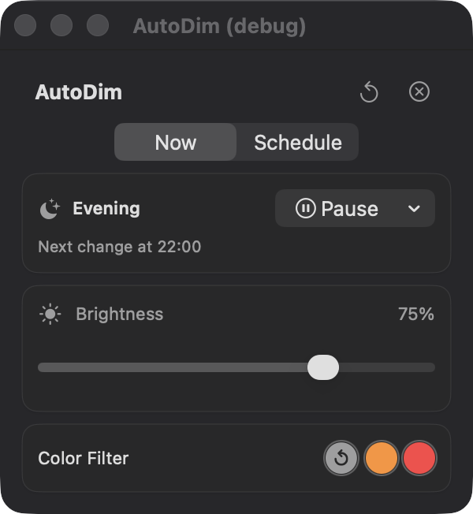
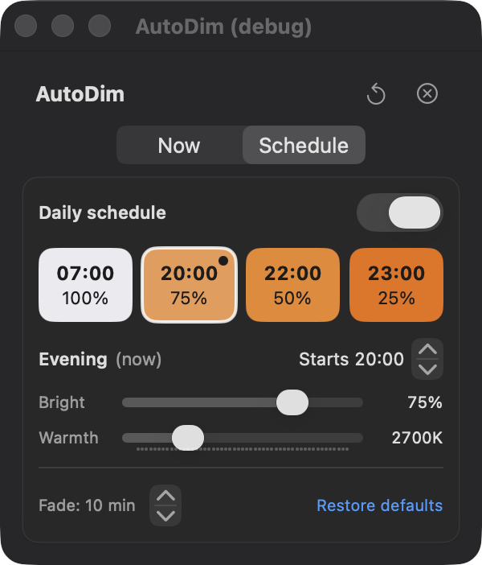

# AutoDim

AutoDim is a macOS menu bar app that dims your screen and removes blue light on a daily schedule, so your display winds down before bedtime.

## Credit

AutoDim is a fork of [DisplayFilter](https://github.com/uyasarkocal/DisplayFilter) by Yaşar Koçal (MIT licensed). The menu bar app, gamma-table dimming and color filters are his work; the daily schedule, color-temperature phases, persistence, launch at login and multi-display fixes were added on top. The original copyright notice is kept in `LICENSE`. DisplayFilter was inspired by [MonitorControl](https://github.com/MonitorControl/MonitorControl) and [f.lux](https://justgetflux.com/).

## Features

- Built-in daily schedule: full brightness and no filter from 07:00, then three progressively dimmer and warmer evening phases (defaults 20:00, 22:00, 23:00), each fading in over 10 minutes; all times, brightness and color temperatures are editable
- Pause: "Until next phase", "For 1 hour" or "Until tomorrow" returns the screen to normal, then the schedule resumes
- Manual changes hold until the next scheduled boundary, then the schedule resumes
- Software brightness control below the display's native level, and warm manual color filters (orange, red) with adjustable intensity
- Applies to all connected displays
- Lives in the menu bar, with a Now tab and a Schedule tab

 

Brightness is a software gamma adjustment. It does not change the display's hardware backlight.

## Install

Requires macOS 15.0 or later on Apple Silicon (the build targets arm64; Intel Macs are not supported).

**Download:** get `AutoDim-1.0.0.zip` from [Releases](https://github.com/cipshadow/autodim/releases), unzip it and move `AutoDim.app` to `/Applications`. The app is ad-hoc signed, not notarized, so macOS blocks the first launch. Either open System Settings, Privacy & Security, and choose "Open Anyway", or run `xattr -dr com.apple.quarantine /Applications/AutoDim.app` once.

**Or build from source:**

1. Clone this repository.
2. Run `./build.sh` (needs only the Xcode Command Line Tools, not full Xcode). It builds and ad-hoc signs `build/AutoDim.app`.
3. Copy `build/AutoDim.app` to `/Applications` and open it.
4. To start it at login, add it in System Settings, General, Login Items. The schedule only runs while the app is open.

Other gamma-based tools such as f.lux change the same display settings; run only one at a time.

## Why these defaults

What the research supports, and what it does not:

- Evidence: expert consensus recommends low evening light starting at least 3 hours before bedtime ([Brown et al. 2022](https://journals.plos.org/plosbiology/article?id=10.1371%2Fjournal.pbio.3001571)), and evening light suppresses melatonin in a dose-dependent way ([Gooley et al. 2011](https://pubmed.ncbi.nlm.nih.gov/21193540/), [Phillips et al. 2019](https://www.pnas.org/doi/10.1073/pnas.1901824116)).
- Evidence: on a tablet, a warm filter alone did not reduce melatonin suppression, but a lower brightness combined with the filter did ([Nagare et al. 2019](https://pubmed.ncbi.nlm.nih.gov/31191118/)). Brightness does most of the work here; warmth is secondary.
- Evidence: in a display study, melanopic content (the part of the light the body clock responds to) drove melatonin, sleep latency and alertness effects, independent of how the screen looked ([PMC9974389](https://pmc.ncbi.nlm.nih.gov/articles/PMC9974389/)). Removing blue lowers it.
- Not shown: I found no randomized trial showing that software filters like this improve sleep, and people differ more than 50-fold in sensitivity to evening light. The phase times and strengths are defaults to tune, not tested doses, and room lighting matters too.

## Development

- `./build.sh debug` adds the `--simulate-time HH:MM` and `--debug-window` launch arguments for testing the schedule.
- `./build.sh check` runs the schedule math checks.
- The Xcode project (`DisplayFilter.xcodeproj`) also builds the app but has not been built on the maintainer's machine.

## License

MIT, see [LICENSE](LICENSE).
